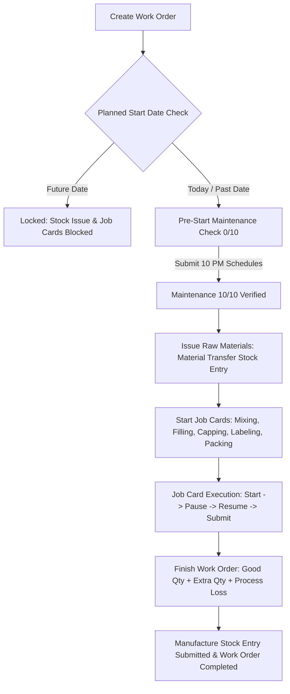

# Island Chill ERP & Manufacturing Execution System (MES)
## Complete Project Handover & Technical Documentation

> **IMPORTANT PROTOCOL FOR DEVELOPERS & AI AGENTS:**  
> **Every time before making any update, commit, or push in git, you MUST update this `HANDOVER.md` file with the latest changes, modified endpoints, new doctypes/fields, and UI adjustments.**

---

## 1. Executive Summary & Project Overview

**Island Chill MES** is a production management, quality assurance, laboratory monitoring, safety compliance, and plant maintenance system specifically engineered for the **Island Chill Bottling Facility (Carpenters Waters Fiji PTE Limited)**.

The system delivers a modern React Single Page Application (SPA) embedded seamlessly into the **Frappe / ERPNext v15** framework, replacing paper forms with digitized, auditable workflows that directly post to ERPNext standard DocTypes (Work Orders, Job Cards, Stock Entries, Sales Invoices, Delivery Notes) and custom compliance DocTypes.

```
+-----------------------------------------------------------------------------------------+
|                              React 19 + Vite Frontend SPA                               |
|   (Dashboard, Work Orders, Maintenance, Laboratory, Cleaning, Safety, Inventory, HRMS)   |
+--------------------------------------------+--------------------------------------------+
                                             | HTTP REST / RPC (frappe.js)
                                             v
+--------------------------------------------+--------------------------------------------+
|                             Frappe / ERPNext v15 Backend                                |
|   - Custom Island Chill App: islandchill/api/manufacturing.py, maintenance_template.py  |
|   - Core DocTypes: Work Order, Job Card, Stock Entry, BOM, Item, UOM, Employee          |
|   - Custom DocTypes: Daily Preventative Maintenance Schedule, Machine Breakdown, etc.   |
+--------------------------------------------+--------------------------------------------+
                                             |
                                             v
+-----------------------------------------------------------------------------------------+
|                                  MariaDB Database                                       |
|                       Site: islandchill.local (Port 8000 / Bench)                       |
+-----------------------------------------------------------------------------------------+
```

---

## 2. Directory Structure & Key Files

```
frappe-islandchill/
├── apps/
│   ├── islandchill/                          # Main Island Chill Custom App Repository
│   │   ├── HANDOVER.md                       # THIS FILE - Master Project Handover Guide
│   │   ├── frontend/                         # React 19 + Vite Frontend Application
│   │   │   ├── package.json                  # Scripts: dev, build, copy-html-entry
│   │   │   ├── vite.config.js                # Vite build configuration (base: /assets/islandchill/frontend/)
│   │   │   ├── src/
│   │   │   │   ├── App.jsx                   # Main orchestrator, global modal state, navigation
│   │   │   │   ├── App.css                   # Global design tokens, themes, typography, layout
│   │   │   │   ├── components/               # Modular Tab Components
│   │   │   │   │   ├── WorkOrdersTab.jsx     # Work Orders, Job Cards & Stock Issue launcher
│   │   │   │   │   ├── DashboardTab.jsx      # Production KPIs, live metrics & shift dashboards
│   │   │   │   │   ├── MaintenanceTab.jsx    # PM checklists, equipment master & breakdown logs
│   │   │   │   │   ├── LaboratoryTab.jsx     # Lab QA forms (Micro, Water, Chemical, Taste, Form 35, 86, 88)
│   │   │   │   │   ├── CleaningTab.jsx       # 7 Cleaning & CIP logs (Toilets, Floor, Lab, CIP)
│   │   │   │   │   ├── SafetyTab.jsx         # Safety checklists, Swab tests, First Aid, Incident logs
│   │   │   │   │   ├── InventoryTab.jsx      # Warehouse stock balances & bin quantities
│   │   │   │   │   ├── BOMTab.jsx            # Multi-level Bill of Materials explorer & recipes
│   │   │   │   │   └── SalesTab.jsx          # Sales Invoices, Delivery Notes & Pick Lists
│   │   │   │   ├── modules/                  # Auxiliary Modules (HRMS, Support Desk, 2FA/TOTP)
│   │   │   │   │   ├── HRMSModule.jsx        # Employee directory, shifts & BPMN workflow designer
│   │   │   │   │   └── SupportModule.jsx     # Incident ticketing desk & AI operations assistant
│   │   │   │   └── services/
│   │   │   │       └── frappe.js             # Centralized Frappe REST/RPC API client
│   │   ├── islandchill/                      # Backend Python Package
│   │   │   ├── hooks.py                      # Frappe hooks (fixtures, www routes, website context)
│   │   │   ├── api/                          # Whitelisted Backend API Modules
│   │   │   │   ├── manufacturing.py          # Core manufacturing, stock entries, job cards, PM APIs
│   │   │   │   └── maintenance_template.py   # Maintenance template resolver & checklist loader
│   │   │   ├── fixtures/                     # Exportable/Importable JSON Fixtures
│   │   │   │   ├── equipment_list.json       # Plant equipment records
│   │   │   │   ├── maintenance_checklist_master.json # 10 Equipment PM checklist definitions
│   │   │   │   ├── custom_field.json         # Custom fields added to core ERPNext DocTypes
│   │   │   │   └── property_setter.json      # DocType customizations
│   │   │   ├── public/frontend/              # Built frontend production assets (JS, CSS, images)
│   │   │   └── www/                          # Web entry routes
│   │   │       ├── islandchill.html          # Production HTML entry point
│   │   │       └── islandchill.py            # Route context generator (CSRF token, boot data)
│   └── erpnext/                              # Core ERPNext v15 App
├── sites/
│   └── islandchill.local/                    # Primary Site Directory
│       └── site_config.json                  # Database connection, ports & developer mode
└── env/                                      # Python 3 Virtual Environment
```

---

## 3. End-to-End Production & Manufacturing Flow

The manufacturing module enforces a strict, compliant sequence on the factory floor:



### Detailed Workflow Stages:

1. **Work Order Creation**:
   - Production line selection: **Filling Line 1** (Natural Mineral Water) or **Filling Line 2** (CSD / RTD / Flavoured).
   - Selects BOM, finished goods warehouse (`Finished Goods - CWFL`), and source warehouse (`Raw Materials - CWFL`).
   - Planned Start Date is set via `type="date"`. Start time is automatically assigned from internal system time upon execution.

2. **Planned Date Verification (Future Date Lock)**:
   - If `planned_start_date` is in the future, raw material issuance, pre-start maintenance completion, and job card start are blocked to prevent premature consumption.

3. **Mandatory Pre-Start Maintenance Validation**:
   - Before raw materials can be issued or job cards started, 10 equipment stations must be inspected and submitted under `Daily Preventative Maintenance Schedule`:
     1. **Air Compressor** (Utilities / Filling Line 1)
     2. **Boiler** (Utilities / Filling Line 1)
     3. **Syrup and CIP Equipment** (Utilities / Filling Line 1)
     4. **Glycol Chilling Plant & Grasso Refrigerator** (Utilities / Filling Line 1)
     5. **Data Coder** (CSD / RTD Line / Filling Line 2)
     6. **Conveyors** (CSD / RTD Line / Filling Line 2)
     7. **CO2 Mixer** (CSD / RTD Line / Filling Line 2)
     8. **Bottle / Can Washer** (CSD / RTD Line / Filling Line 2)
     9. **De-Palletizer** (RTD Line / Filling Line 2)
     10. **CSD / RTD Filler** (Bottling Line / Filling Line 2)
   - Equipment name matching is normalized (e.g., `Air Compressor` resolves cleanly even if legacy records reference `Air Compressor - 1`).

4. **Raw Material Issue (`Material Transfer for Manufacture`)**:
   - Operators can save a draft stock entry or submit it directly.
   - Transวิfer posts raw materials from `Raw Materials - CWFL` to `Work In Progress - CWFL`.
   - Work order status transitions to `In Progress`. Multiple transfers against the same Work Order are prevented.

5. **Job Card Lifecycle**:
   - Each operation (Mixing, Blow Moulding, Filling, Labeling, Packing, Palletizing) generates a Job Card.
   - **Start**: Logs start timestamp and assigns employee.
   - **Pause / Resume**: Operators can pause with a reason (status changes to `On Hold`), requiring resume before submission.
   - **Finish**: Records completed qty, loose qty, and process loss qty.
   - **Audit Trail**: Every Start, Pause, Resume, and Finish event is appended to `Job Card.remarks` with timestamps and operator identity.

6. **Finishing Work Order & Process Loss Accounting**:
   - Operators specify completed Good Qty, Extra Goods Qty (with unit of measure), and Process Loss Qty.
   - Multi-UOM conversion is resolved dynamically against the item's base `stock_uom`.
   - Formula validation: `Extra Qty + FG Qty <= Planned Qty` ensures non-negative process loss.
   - Generates and submits the final `Manufacture` Stock Entry, transferring WIP to Finished Goods and posting GL entries.

---

## 4. Key Frontend Modules & Components

| Component / Tab | File Path | Key Responsibilities |
| :--- | :--- | :--- |
| **`App.jsx`** | `src/App.jsx` | Main state controller, tab switcher, global modal handlers (Quick PM fill, stock issue, finish WO), connection manager. |
| **`WorkOrdersTab.jsx`** | `src/components/WorkOrdersTab.jsx` | WO cards, line filtering, status badges, progress bars, quick start buttons, job card management. |
| **`DashboardTab.jsx`** | `src/components/DashboardTab.jsx` | Plant KPIs, live output vs target, active line status, maintenance completion summary. |
| **`MaintenanceTab.jsx`** | `src/components/MaintenanceTab.jsx` | Daily PM checklist forms, grid/list view, equipment filter, breakdown logs (`Machine Breakdown`), PDF/print export. |
| **`LaboratoryTab.jsx`** | `src/components/LaboratoryTab.jsx` | Lab QA forms: Form 35 (Gold Stone Rum & Cola), Form 86 (Incubator Temperature), Form 88 (Weight Check), Micro Analysis, Chemical Tests, Taste & Visual Inspection. |
| **`CleaningTab.jsx`** | `src/components/CleaningTab.jsx` | 7 Sanitation logs: Toilets, Dining Room, Factory Floor, Lab & Office, Incubator, Balance Calibration, Equipment Sanitation & CIP. |
| **`SafetyTab.jsx`** | `src/components/SafetyTab.jsx` | Safety & Compliance: Standard Form 17 First Aid, Environmental Swabs, Safety Induction, Injury Reports, Accident & Disease Notification. |
| **`InventoryTab.jsx`** | `src/components/InventoryTab.jsx` | Warehouse stock balances, batch lookup, bin quantities, stock level indicators. |
| **`BOMTab.jsx`** | `src/components/BOMTab.jsx` | Multi-level Bill of Materials explorer, operation sequences, workstation routing, scrap items. |
| **`SalesTab.jsx`** | `src/components/SalesTab.jsx` | Sales Orders, Sales Invoices, Delivery Notes, customer dispatch registers. |
| **`HRMSModule.jsx`** | `src/modules/HRMSModule.jsx` | Employee directory, shift tracking, BPMN process workflow diagram designer. |
| **`SupportModule.jsx`** | `src/modules/SupportModule.jsx` | Support ticketing desk, issue tracking, Carpenters AI Operations Assistant. |
| **`frappe.js`** | `src/services/frappe.js` | REST client, CSRF header attachment, whitelisted method execution, error normalization. |

---

## 5. Backend Whitelisted APIs (`islandchill/api/`)

### `manufacturing.py`
- `get_work_order_dashboard(limit=20, start=0, company='', status='')`: Returns work orders with job cards, stock entry state, maintenance checklist completion count, and BOM info.
- `create_work_order(item, qty, company, bom_no, planned_start_date, ...)`: Validates and creates a Work Order with custom production line tag.
- `save_stock_entry_draft(work_order, company, posting_date, posting_time, items)`: Creates or updates a draft `Material Transfer for Manufacture` Stock Entry.
- `submit_stock_entry(stock_entry_name)`: Submits the saved draft Stock Entry.
- `start_job_card(job_card, employee, remarks, actual_start_time)`: Starts Job Card timer and updates status to `Work In Progress`.
- `pause_job_card(job_card, remarks, actual_end_time)`: Pauses Job Card timer (`is_paused=1`, `status="On Hold"`).
- `resume_job_card(job_card, remarks, actual_start_time)`: Resumes Job Card timer (`is_paused=0`, `status="Work In Progress"`).
- `submit_job_card(job_card, remarks, actual_end_time, qty, for_quantity, loose_qty, process_loss_qty)`: Completes and submits the Job Card.
- `finish_work_order(work_order, qty, process_loss_qty, extra_qty, extra_uom, company, submit=1)`: Creates and submits final `Manufacture` Stock Entry.
- `get_work_order_maintenance_checklists(work_order)`: Returns completion status of all 10 mandatory equipment checklists for a given Work Order.
- `create_daily_pm_schedule(equipment, area, work_order, operator, supervisor, overall_remarks, maintenance_details, ...)`: Submits a `Daily Preventative Maintenance Schedule` record.

### `maintenance_template.py`
- `get_maintenance_templates(production_line=None, work_order=None)`: Fetches checklist masters from `Maintenance Checklist Master` and resolves production line mappings.
- `resolve_equipment_production_line(eq_name)`: Maps equipment names to `Filling Line 1` or `Filling Line 2`.

---

## 6. Common Developer Commands & Operations

### Build & Deploy Frontend
```bash
cd /home/anantdv/frappe-islandchill/apps/islandchill/frontend
npm run build
```
*(Runs Vite build into `apps/islandchill/islandchill/public/frontend` and copies `index.html` to `apps/islandchill/islandchill/www/islandchill.html`)*

### Backend Bench Commands
```bash
cd /home/anantdv/frappe-islandchill

# Run database migrations / import fixtures
bench --site islandchill.local migrate

# Export fixtures
bench --site islandchill.local export-fixtures

# Clear cache
bench --site islandchill.local clear-cache
```

### Python Interactive / Test Script Execution
```bash
cd /home/anantdv/frappe-islandchill
./env/bin/python -c "
import frappe
frappe.init(site='islandchill.local')
frappe.connect()
print('Connected to', frappe.local.site)
"
```

---

## 7. Recent Changes & Fixes Log

| Date | Area | Description of Change |
| :--- | :--- | :--- |
| **2026-09-23** | Laboratory QA & Work Order Dynamic Alignment | Dynamically aligned all Laboratory cards (4 summary metric cards and 22 QA checklist template cards) with the selected Work Order. Added per-WO completion tracking, status indicators (`✓ Logged for WO` vs `⏳ Pending for WO`), quick status tabs (All / Pending / Logged), and real-time checklist filtering. |
| **2026-09-23** | Laboratory QA & Work Order Context | Added Work Order Selector banner at the head of Laboratory section (`LaboratoryTab.jsx` & `App.jsx`). Allows selecting an active Work Order which automatically pre-fills the `work_order` field for all 22 Lab Form modals and supports filtering the Lab Quality Control Register by Work Order. |
| **2026-09-23** | Laboratory & QA DocTypes | Audited all 22 Laboratory QA forms. Created missing `work_order` fields on 16 ERPNext DocTypes, updated UI modals (Form 35, Form 88, dynamic forms), and updated `handleSaveLaboratory` sync payloads. Exported custom fields fixture. |
| **2026-09-23** | Frontend API Client | Fixed `ReferenceError: baseUrl is not defined` in `saveStockEntryDraft()` inside `frappe.js`. Rebuilt production bundle. |
| **2026-09-23** | Maintenance & Equipment | Renamed `Air Compressor - 1` to `Air Compressor` across MariaDB, fixtures, API resolvers, and UI modals to match updated ERPNext naming. |
| **2026-09-15** | Work Order Creation | Fixed Filling Line selection logic in `WorkOrdersTab.jsx` and Work Order modal so user-selected line (Line 1 vs Line 2) persists properly to ERPNext. |
| **2026-09-15** | Laboratory QA | Added Form 35 (Gold Stone Rum & Cola), Form 86 (Incubator Temperature Record), and Form 88 (Weight Check Checklist). |
| **2026-08-24** | Cleaning & CIP | Enhanced print and approval workflows for 7 standard cleaning records. |

---

## 8. Pre-Git Commit Protocol Checklist

Before running `git commit` or `git push`, make sure to:

- [ ] **Update this `HANDOVER.md`**: Add any new features, API methods, DocTypes, or bugfixes to Section 7 & relevant sections.
- [ ] **Verify Frontend Build**: Run `cd apps/islandchill/frontend && npm run build` to ensure assets and `islandchill.html` are compiled.
- [ ] **Verify Database Integrity**: If DocTypes or custom fields were modified, export fixtures using `bench --site islandchill.local export-fixtures`.
- [ ] **No Secrets**: Ensure no API keys, private passwords, or temporary test credentials are committed.
